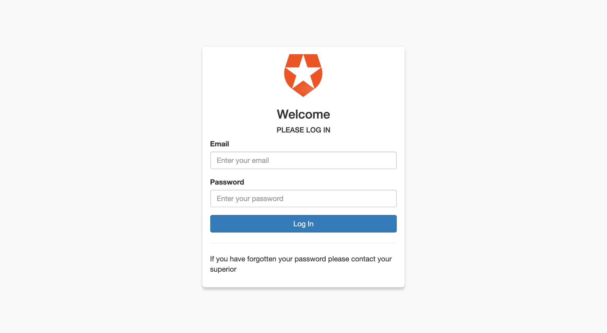
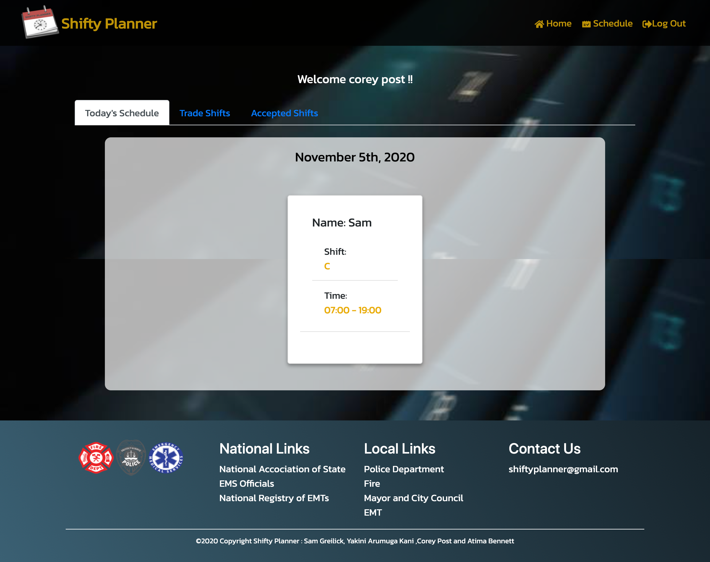
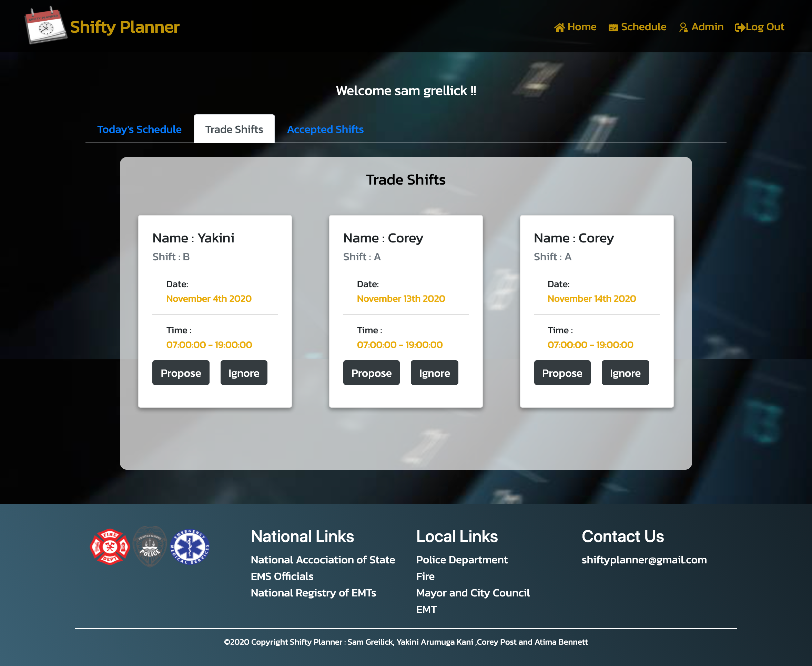
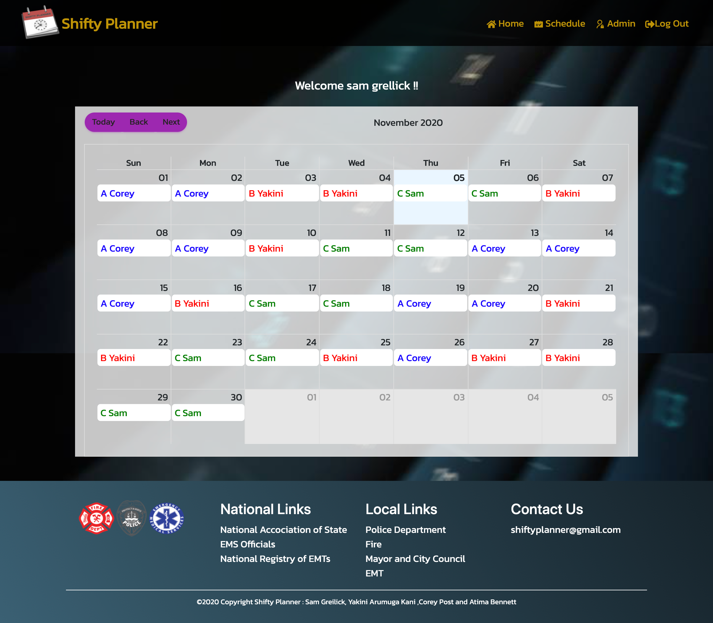
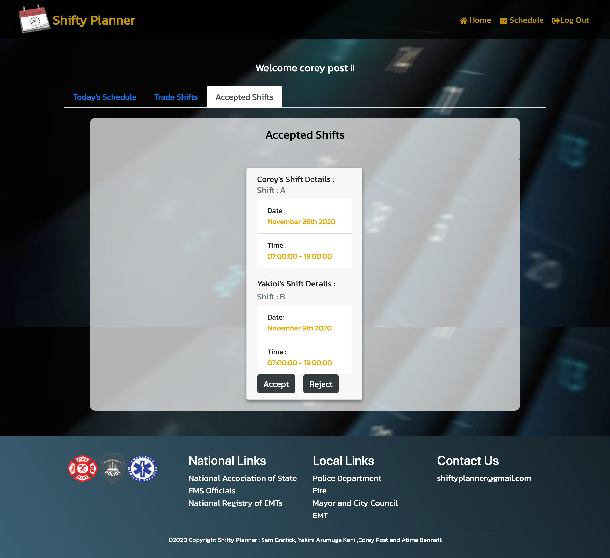

## Project Name 

# Shifty Planner 

## Description

Shift managment and time keeping system with a focus on the needs of first responders.  

## Table of Contents  

- [Description](#description)
- [Installation](#installation)
- [Usage](#usage)
- [Contributing](#contributing)
- [Tests](#tests)
- [License](#license)
- [Questions](#questions) 

## Media

[Link to Website](https://shifty-planner.herokuapp.com/)

 

## Tests

1. First sign in with given username and password. username: test@mail.com and password: Password123

2. Next go to schedule and select your shift you want to trade. If some alert pops up you can't make trade on that shift (it will be already in process/ not your shift)

3. Once you made the trade, others will be notified by email.

4. Others can see your trade on their homepage under `Trade Shift`.

5. They can `Accept/Ignore` your trade.

6. On Accept, they have a dropdown to select. Click `Submit` after selecting comfortable date to swap.

7. On Ignore, it goes away.

8. If clicked `Accept`, you can see them on Accepted Shifts tab.

9. Details like date of your trade and the other persons shift details with name, shift, date and time are shown.

10. If you are comfortable with their date, you can exchange with them on clicking `Accept`.

11. If you don't need that date, just ignore. And you will be released to make the trade again.

## New Technologies Used for this Project

Auth0 secure universal log in.

EmailJS.
  
## License

This application is covered under the GPLv3 license.

## Questions

Please send questions or inquiries to: samgreilick@gmail.com